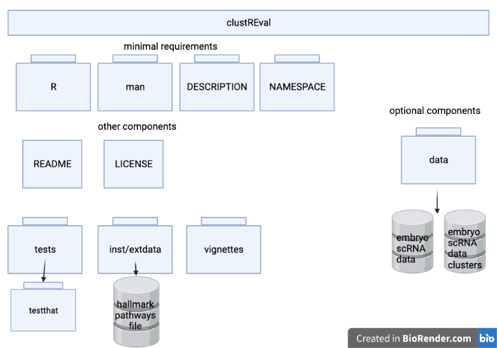

<!-- README.md is generated from README.Rmd. Please edit that file -->

# ClustREval

<!-- badges: start -->

<!-- badges: end -->

## Description

ClustREval is a package for evaluating the performance of different
clustering pipelines on scRNA-seq data using unsupervised metrics and
gene set enrichment analysis. Clustering is a powerful tool for helping
researchers to detect cellular heterogeniety. However, clustering
performance is highly dependent on parameters used in the clustering
pipeline, for which there are no systematic recommendations. This
package allows users to compute clustering results from various
clustering pipelines defined by user-specified parameters. Clustering
results can then be evaluated using comparing unsupervised clustering
metrics and differential gene expression between results.

## Installation

To install the latest version of the package:

``` r
require("devtools")
devtools::install_github("cindyfang70/clustREval", build_vignettes = TRUE)
library("clustREval")
```

## Overview

``` r
ls("package:clustREval")
data(package = "clustREval") # optional
```

``` r
browseVignettes("clustREval")
```

clustREval contains four functions that aid in the evaluation of
clustering performance.

The `runPipelineCombs` function runs all combinations of user-specified
clustering pipelines. The user simply has to define the various
parameters to use at each step in the pipeline and provide the data to
perform clustering on.

The `computeUnsupervisedMetrics` function computes the Dunn index and
mean silhouette width of a clustering output.

The `geneSetEval` function performs Gene Set Enrichment Analysis (GSEA)
on each of the clusters from a clustering output and returns enrichment
scores based on the Hallmark Pathways from MSigDB.

The `plotGeneSetEval` function plots the enrichment scores from GSEA.

An overview of the package is illustrated below:


## Contributions

The author for this package is Xin Zhi Fang.

The `runPipelineCombs` uses the `pipeComp` library to run all pipeline
combinations, but does not use the same end results. The evaluation step
from the `pipeComp` library is bypassed as it depends on cell type
labels (which are not always available).

The `fgsea` package is used to perform GSEA on the clusters. As well,
`AnnotationDbi` and `org.Hs.eg.db` are used to help map the gene symbols
to names.

`scran`,`Seurat`, and `scuttle` are used in various functions for
preprocessing of the scRNA-seq data.

`SingleCellExperiment` is used in almost all functions to store
scRNA-seq data.

`cluster` and `clValid` were used to calculate the silhouette score and
Dunn index, respectively.

`ggplot2` and `gridExtra` were used for plotting functionality.

`labelled`, `tibble`, `tidyverse`, `dplyr`, and `magrittr` were used for
data manipulation.

## References

1.  Germain, P. L., Sonrel, A., & Robinson, M. D. (2020). pipeComp, a
    general framework for the evaluation of computational pipelines,
    reveals performant single cell RNA-seq preprocessing tools. *Genome
    Biology*, 21(1). <https://doi.org/10.1186/s13059-020-02136-7>

2.  Love, M. I., Huber, W., & Anders, S. (2014). Moderated estimation of
    fold change and dispersion for RNA-seq data with DESeq2. *Genome
    Biology*, 15(12). <https://doi.org/10.1186/s13059-014-0550-8>

3.  Amezquita, R. A., Lun, A. T. L., Becht, E., Carey, V. J., Carpp, L.
    N., Geistlinger, L., Marini, F., Rue-Albrecht, K., Risso, D.,
    Soneson, C., Waldron, L., Pagès, H., Smith, M. L., Huber, W.,
    Morgan, M., Gottardo, R., & Hicks, S. C. (2019). Orchestrating
    single-cell analysis with Bioconductor. *Nature Methods*, 17(2),
    137–145. <https://doi.org/10.1038/s41592-019-0654-x>

4.  Korotkevich, G., Sukhov, V., Budin, N., Shpak, B., Artyomov, M. N.,
    & Sergushichev, A. (2016). Fast gene set enrichment analysis.
    BioRxiv. Published. <https://doi.org/10.1101/060012>

5.  McCarthy DJ, Campbell KR, Lun ATL, Willis QF (2017). “Scater:
    pre-processing, quality control, normalisation and visualisation of
    single-cell RNA-seq data in R.” *Bioinformatics*, *33*, 1179-1186.
    doi: 10.1093/bioinformatics/btw777 (URL:
    <https://doi.org/10.1093/bioinformatics/btw777>).

6.  Joseph Larmarange (2021). labelled: Manipulating Labelled Data. R
    package version 2.9.0. <https://CRAN.R-project.org/package=labelled>

7.  Lun ATL, McCarthy DJ, Marioni JC (2016). “A step-by-step workflow
    for low-level analysis of single-cell RNA-seq data with
    Bioconductor.” *F1000Res.*, *5*, 2122. doi:
    10.12688/f1000research.9501.2 (URL:
    <https://doi.org/10.12688/f1000research.9501.2>).

8.  Hervé Pagès, Marc Carlson, Seth Falcon and Nianhua Li (2020).
    AnnotationDbi: Manipulation of SQLite-based annotations in
    Bioconductor. R package version 1.52.0.
    <https://bioconductor.org/packages/AnnotationDbi>

9.  Wickham et al., (2019). Welcome to the tidyverse. Journal of Open
    Source Software, 4(43), 1686, <https://doi.org/10.21105/joss.01686>

10. Guy Brock, Vasyl Pihur, Susmita Datta, Somnath Datta (2008).
    clValid: An R Package for Cluster Validation. Journal of Statistical
    Software, 25(4), 1-22. URL <https://www.jstatsoft.org/v25/i04/>

11. Hao and Hao et al. Integrated analysis of multimodal single-cell
    data. *Cell* (2021)

12. Maechler, M., Rousseeuw, P., Struyf, A., Hubert, M., Hornik,
    K.(2021). cluster: Cluster Analysis Basics and Extensions. R package
    version 2.1.2.

13. Hadley Wickham, Romain François, Lionel Henry and Kirill Müller
    (2021). dplyr: A Grammar of Data Manipulation. R package version
    1.0.7. <https://CRAN.R-project.org/package=dplyr>

14. Kirill Müller and Hadley Wickham (2021). tibble: Simple Data Frames.
    R package version 3.1.6. <https://CRAN.R-project.org/package=tibble>

15. H. Wickham. ggplot2: Elegant Graphics for Data Analysis.
    Springer-Verlag New York, 2016.

16. Stefan Milton Bache and Hadley Wickham (2020). magrittr: A
    Forward-Pipe Operator for R. R package version 2.0.1.
    <https://CRAN.R-project.org/package=magrittr>

17. Baptiste Auguie (2017). gridExtra: Miscellaneous Functions for
    “Grid” Graphics. R package version 2.3.
    <https://CRAN.R-project.org/package=gridExtra>

18. Carlson M (2019). org.Hs.eg.db: Genome wide annotation for Human. R
    package version 3.8.2.

## Acknowledgements

This package was developed for BCB410H: Applied Bioinformatics,
University of Toronto, Toronto, CANADA, 2019-2021.
